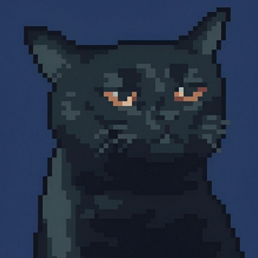
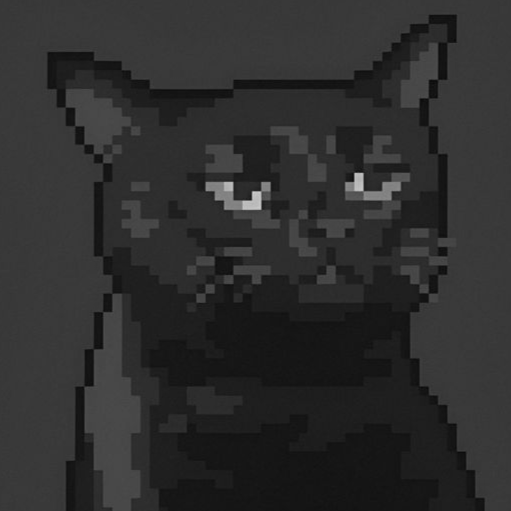
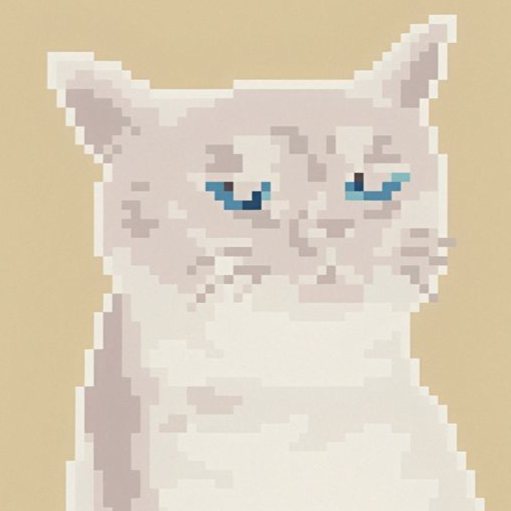
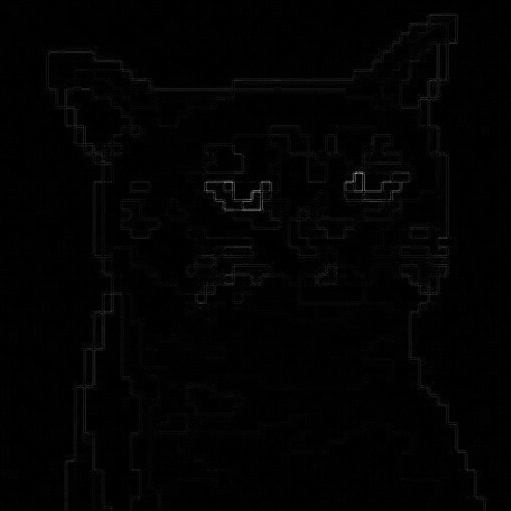

# SIMD Image Filter

A high-performance image filtering tool using SIMD (SSE2/SSE3) instructions for accelerated pixel processing.

## Features

- **Greyscale** - Convert RGB images to single-channel greyscale using luminance formula
- **Invert** - Invert image colors (negative effect)
- **Gaussian Blur** - Apply configurable Gaussian blur with separable convolution
- **Laplacian Edge Detection** - Detect edges using Laplacian kernel

## Requirements

- C++23 compatible compiler (GCC 13+ or Clang 16+)
- Boost (program_options)
- SSE2/SSE3 capable CPU

## Building

```bash
make
```

## Usage

```bash
./simd-filter -I <input.png> [-O <output.png>] [-F <filter>] [--blur-strength <value>]
```

### Options

| Option | Description | Default |
|--------|-------------|---------|
| `-h, --help` | Show help message | - |
| `-I, --input-file` | Input PNG file (required) | - |
| `-O, --output-file` | Output PNG file | `out-<input>` |
| `-F, --filter` | Filter type: `greyscale`, `invert`, `gaussian`, `laplace` | `greyscale` |
| `--blur-strength` | Gaussian blur strength (sigma = value/10) | `10` |

### Examples

```bash
# Convert to greyscale
./simd-filter -I cat.png -F greyscale -O greyscale.png

# Invert colors
./simd-filter -I cat.png -F invert -O invert.png

# Apply Gaussian blur (strength 20)
./simd-filter -I cat.png -F gaussian --blur-strength 20 -O gaussian.png

# Edge detection
./simd-filter -I cat.png -F laplace -O laplace.png
```

## Example Results

### Original


### Greyscale


### Invert


### Gaussian Blur (strength=20)


### Laplacian Edge Detection


## Filter Details

### Greyscale
Uses the standard luminance formula:
```
Y = 0.299*R + 0.587*G + 0.114*B
```
Implemented with fixed-point arithmetic for SIMD optimization.

### Invert
Simple color inversion: `output = 255 - input` for each channel.
Processes 16 bytes at a time using SSE2 instructions.

### Gaussian Blur
- Uses separable 2-pass convolution (horizontal + vertical)
- Dynamically sized kernel based on blur strength
- Kernel radius = ceil(3 * sigma), covering 99.7% of distribution

### Laplacian Edge Detection
Applies the Laplacian kernel after greyscale conversion:
```
[ 0 -1  0]
[-1  4 -1]
[ 0 -1  0]
```

## License

MIT License

Copyright 2026 Vivek Dhiman (https://github.com/88VwV88)

Permission is hereby granted, free of charge, to any person obtaining a copy of this software and associated documentation files (the “Software”), to deal in the Software without restriction, including without limitation the rights to use, copy, modify, merge, publish, distribute, sublicense, and/or sell copies of the Software, and to permit persons to whom the Software is furnished to do so, subject to the following conditions:

The above copyright notice and this permission notice shall be included in all copies or substantial portions of the Software.

THE SOFTWARE IS PROVIDED “AS IS”, WITHOUT WARRANTY OF ANY KIND, EXPRESS OR IMPLIED, INCLUDING BUT NOT LIMITED TO THE WARRANTIES OF MERCHANTABILITY, FITNESS FOR A PARTICULAR PURPOSE AND NONINFRINGEMENT. IN NO EVENT SHALL THE AUTHORS OR COPYRIGHT HOLDERS BE LIABLE FOR ANY CLAIM, DAMAGES OR OTHER LIABILITY, WHETHER IN AN ACTION OF CONTRACT, TORT OR OTHERWISE, ARISING FROM, OUT OF OR IN CONNECTION WITH THE SOFTWARE OR THE USE OR OTHER DEALINGS IN THE SOFTWARE.

